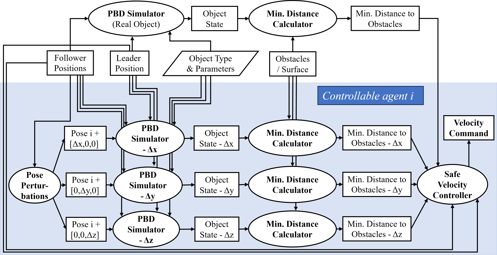

# Collaborative Manipulation of Deformable Objects with Obstacle Avoidance
This repository includes the implementation of "Collaborative Manipulation of Deformable Objects with Obstacle Avoidance" paper submitted for ICRA 2023.

## Installation
On a ROS Noetic installed Ubuntu 20.04, download and run `install.bash`. 

It creates `catkin_ws_deformable` workspace in your `home` directory, clones the related repositories, and installs.

Note that **SOME OF THE PRIVATE REPOS WILL BE MADE PUBLIC AFTER THE REVIEW PROCESS.**

## Software Architecture

## Video 
https://github.com/burakaksoy/deformable_manipulations/assets/34518156/f9806d55-a2e2-4bd7-bea3-a7e547a66127

